# Regression Execution Flow

How a `@regression` (or any tag-based) run goes from trigger to e-mail —
step by step, for the whole team to follow along.

> Render the Mermaid diagrams at <https://mermaid.live>, on GitHub, or in
> VS Code. An ASCII summary follows for quick reading.

---

## End-to-end flow (Mermaid)

```mermaid
flowchart TD
    %% ── 1. Trigger ─────────────────────────────────────────
    T["🚀 Trigger<br/>• qa-agent script<br/>&nbsp;&nbsp;(trigger-jenkins.js)<br/>• Jenkins UI<br/>• Scheduled / cron<br/><br/>Params: TAGS, BRANCH, ENV"]

    %% ── 2. Checkout & install ─────────────────────────────
    T --> C1["📥 Checkout SCM<br/>git fetch + checkout BRANCH"]
    C1 --> C2["🔧 Install tools &amp; deps<br/>NodeJS · yarn install<br/>npx playwright install"]

    %% ── 3. Global setup (auth) ─────────────────────────────
    subgraph GS["🔐 Global setup — one-time auth (ui/helpers/authenticate-set-up.ts)"]
        direction TB
        GS1["Launch Chromium<br/>(headed)"] --> GS2["Sign in to the SUT<br/>email → password"]
        GS2 --> GS3{"2FA / OTP<br/>prompted?"}
        GS3 -- yes --> GS4["Complete OTP manually<br/>in the headed window"] --> GS5
        GS3 -- no --> GS5["Dismiss 'I Understand'<br/>(concurrent-session reminder)<br/>if shown"]
        GS5 --> GS6["Open Desk Sandbox portal<br/>verify 'Sandbox Mode' badge"]
        GS6 --> GS7["Warm CRM session<br/>'Verify your identity'<br/>→ password → Confirm"]
        GS7 --> GS8["💾 Save storageState<br/>.auth/storage-state.json<br/>(Desk + CRM cookies)"]
    end
    C2 --> GS1

    %% ── 4. Test run ───────────────────────────────────────
    GS8 --> R0["▶️ playwright test<br/>--grep TAGS<br/>--workers 1 --retries 3"]

    subgraph TR["▶️ Test run — per test (reuses storageState)"]
        direction TB
        TR1["Open browser context<br/>with storageState<br/>(no per-test login)"]
        TR2["Spec → Page Object<br/>→ ActionKeyword<br/>→ Playwright → Chromium"]
        TR3["Drive the SUT<br/>test.step blocks +<br/>expect.soft chains"]
        TR4{"Step<br/>passes?"}
        TR5["Friendly error captured<br/>'Step failed: could not click<br/>option ...' + screenshot + trace"]
        TR6{"Retries<br/>left?"}
        TR1 --> TR2 --> TR3 --> TR4
        TR4 -- yes --> TR_OK["✅ test passed"]
        TR4 -- no --> TR5 --> TR6
        TR6 -- yes --> TR1
        TR6 -- no --> TR_FAIL["❌ test failed"]
    end
    R0 --> TR1

    %% ── 5. Reporting ──────────────────────────────────────
    TR_OK --> POST1
    TR_FAIL --> POST1["📊 Archive artifacts<br/>Playwright HTML report ·<br/>screenshots · videos · traces"]
    POST1 --> POST2["📈 Collect stats<br/>collect-playwright-stats.js"]
    POST2 --> POST3["📑 Publish Allure report"]
    POST3 --> POST4["📧 Email stakeholders<br/>summary + Allure link"]

    %% ── 6. Result ─────────────────────────────────────────
    POST4 --> RES{"Build result"}
    RES -- "all pass" --> R_OK["✅ SUCCESS"]
    RES -- "only @bugs failed" --> R_UNS["⚠️ UNSTABLE<br/>(known defects)"]
    RES -- "real failure" --> R_FAIL["❌ FAILURE"]
```



---

## ASCII summary (quick read)

```
1. TRIGGER
   ┌───────────────────────────────────────────────────────┐
   │ qa-agent script / Jenkins UI / cron                    │
   │ → parameters: TAGS, BRANCH, ENVIRONMENT, TEST_FOLDER   │
   └───────────────────────────────────────────────────────┘
                            │
                            ▼
2. CHECKOUT + INSTALL
   git checkout BRANCH  →  yarn install  →  playwright install
                            │
                            ▼
3. GLOBAL SETUP — ONE-TIME AUTH (headed Chromium)
   sign in to the SUT  →  (2FA if any)  →  open Desk Sandbox
              →  warm CRM ("Verify identity")
              →  save storageState  (.auth/storage-state.json)
                            │
                            ▼
4. TEST RUN — playwright test --grep <TAGS>  (each test reuses storageState)
   ┌──────────────────────────────────────────────────────────┐
   │ Spec → Page Object → ActionKeyword → Playwright → the SUT   │
   │ on failure → retry × 3 → friendly error + trace / video  │
   └──────────────────────────────────────────────────────────┘
                            │
                            ▼
5. REPORTING + EMAIL
   Playwright HTML  ·  Allure report  ·  e-mail summary
                            │
                            ▼
6. BUILD RESULT
   ✅ SUCCESS  /  ⚠️ UNSTABLE (only @bugs failed)  /  ❌ FAILURE
```

---

## Stage-by-stage

### 1. Trigger
A regression run starts in one of three ways:
- **qa-agent script** — `trigger-jenkins.js <tag>` from Phase 4 of the qa-agent
  skill (the Jira label is the tag).
- **Jenkins UI** — "Build with Parameters" → set `TAGS`, `BRANCH`,
  `ENVIRONMENT`, optionally `INVERT_BUGS`.
- **Cron** — a scheduled trigger (not active by default).

Either way, the job receives the same parameters: which tests to run
(`TAGS`), which branch (`BRANCH`), which environment (`ENVIRONMENT`).

### 2. Checkout & install
Jenkins pulls the code from Git at the requested branch (typically `main`),
then installs the Node toolchain plus Playwright's browsers. Clean every
build — no state leaks from the previous run.

### 3. Global setup — one-time authentication
File: `ui/helpers/authenticate-set-up.ts` (called by `ui/helpers/global-setup.ts`).

This is the **only** time the suite logs in to the SUT. It happens **once per
build**, in a real Chromium browser (headed on purpose — if the SUT prompts for
a 2FA / OTP, a human can complete it in the visible window):

1. Open `https://auth.example.com/signin`.
2. Submit email → submit password.
3. Dismiss the "I Understand" concurrent-session reminder if it shows.
4. Open the Desk Sandbox portal (`ENV.DESK_URL`) and verify the
   "Sandbox Mode" badge is visible.
5. **Warm the CRM session**: navigate to `ENV.CRM_URL`; if the SUT shows the
   "Verify your identity" page (which happens the first time a Desk session
   reaches CRM), enter the password and click "Confirm" — once per build,
   not once per test.
6. Save the whole browser session (cookies, local storage, etc.) into
   `.auth/storage-state.json`. This file is the **storageState**
   that every test reuses to start already-logged-in.

### 4. Test run
File: `config/playwright.config.ts` (`use.storageState`).

Playwright Test launches the selected specs with `--grep <TAGS>`:

- Each test opens its own browser context **with the saved storageState** —
  no test ever does its own login again. This is faster and avoids hitting
  the SUT's concurrent-session limit.
- Test code follows a strict 3-layer pipeline:
  `spec → Page Object → ActionKeyword → Playwright → Chromium → the SUT`.
- `test.step` blocks make the report readable; `expect.soft` chains let the
  whole chain be validated in one run.
- If a step times out, the framework throws a **stakeholder-friendly error**
  (e.g. *"Step failed: could not click option "Demolition Request" — not
  visible within 15s"*) and captures a screenshot + trace + video.
- Failed tests retry up to **3 times** (per-spec
  `test.describe.configure({ retries: 3 })`).

### 5. Reporting
After the run:
- Playwright HTML report is generated into `test-output/html`.
- `ci/jenkins/scripts/collect-playwright-stats.js` reads
  `test-output/playwright-report.json` and builds the summary stats.
- The Allure plugin publishes the per-build Allure report at
  `<build-url>/allure/`.
- A summary e-mail is sent to stakeholders with the result + Allure link.

### 6. Build result
Jenkins ends with one of three states:
- ✅ **SUCCESS** — every selected test passed.
- ⚠️ **UNSTABLE** — only tests tagged `@bugs` (known defects) failed. Use
  `INVERT_BUGS=true` to exclude them and get a clean green when you want one.
- ❌ **FAILURE** — a real (non-`@bugs`) test failed, or global setup itself
  could not complete (e.g. the SUT login could not load the Sandbox portal).

---

## Where each piece lives in the repo
| Stage | File / path |
|------|------|
| Claude trigger script | `.claude/skills/qa-agent/scripts/trigger-jenkins.js` |
| Codex trigger script | `.agents/skills/qa-agent/scripts/trigger-jenkins.js` |
| Jenkins pipeline | `ci/jenkins/regression-pipeline` |
| Stats summary for the e-mail | `ci/jenkins/scripts/collect-playwright-stats.js` |
| Global setup | `ui/helpers/global-setup.ts` |
| Authentication | `ui/helpers/authenticate-set-up.ts` |
| Desk login | `ui/page-objects/<app>/login-page.ts` (project-specific) |
| CRM warm-up | `ui/page-objects/<app>-crm/crm-login-page.ts` (project-specific) |
| Action keyword layer (incl. friendly errors) | `ui/helpers/action-keywords.ts` |
| Tag map | `core/test-tags.ts` |
| Playwright config (uses `storageState`) | `config/playwright.config.ts` |
